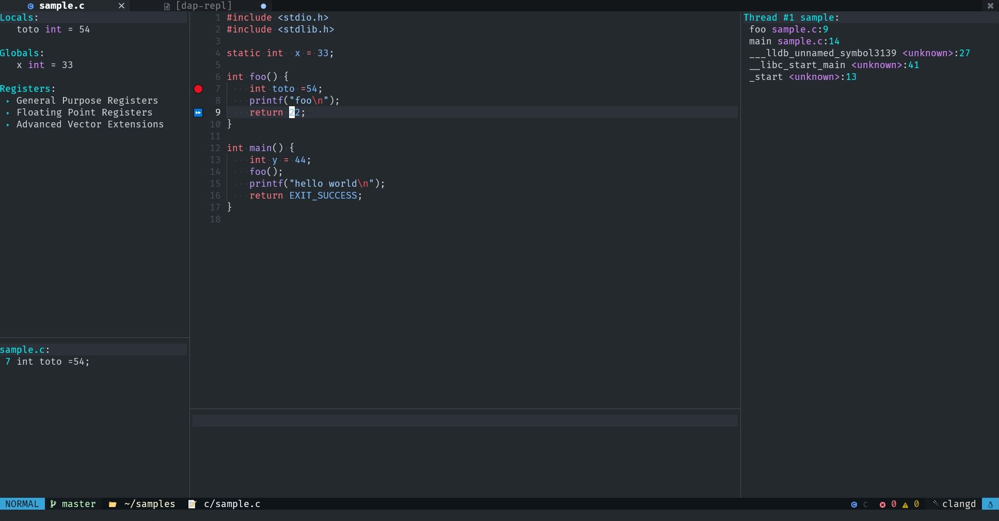

# Neovim Configuration

This is my-own little attempt at a neovim configuration that turns neovim into an 'IDE'. 
This configuration has support for LSP, Treesitter for the programming languages I use. 
Mainly: C/C++, python, Rust, Go, Lua, Dockerfile, bash. It also comes with other goodies.
For a complete list of plugins, see [`packer_specs.lua`](lua/user/packer_specs.lua).
All plugin configurations can be found in [`lua/user/configs`](lua/user/configs).



Tested on neovim 0.8+ on Linux.

## Installation

```bash
# don't forget to backup your config beforehand
git clone https://github.com/meuter/nvim ~/.config/nvim 
nvim --headless -u ~/.config/nvim/install.lua
```

The install script will take care of
- installing [`packer.nvim`](https://github.com/wbthomason/packer.nvim)
- installing all plugins
- installing all Treesitter parser for all supported languages
- installing all LSP servers for all supported languages 

(see [`lua/user/languages.lua`](lua/user/languages.lua) for the list of supported languages)

By default all plugins are pinned to commits listed in [`packer_lock.lua`](lua/user/packer_lock.lua).
To install all plugins from HEAD instead, set `config.lockfile.use_pinned_commit` to `false` in 
[`packer_specs.lua`](lua/user/packer_specs.lua) 

Note that the install pin all packages and store the result in [`packer_lock.lua`](lua/user/packer_lock.lua).

## Trying it out

If you simply want to test this config without messing up your own, you can do so in a Docker container:

```bash
mkdir /tmp/test
cd /tmp/test
git clone https://github.com/meuter/nvim /tmp/test
cd /tmp/test
make test
```

## Prerequisite

See [`Dockerfile`](Dockerfile) for the list of required packages (based on Ubuntu 22.04).
Adapt to your distro accordingly.


