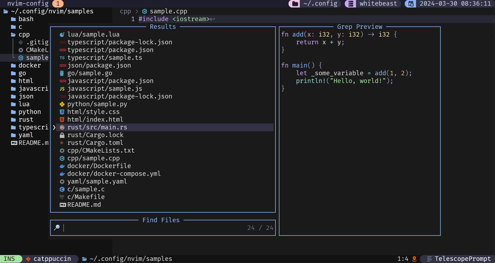
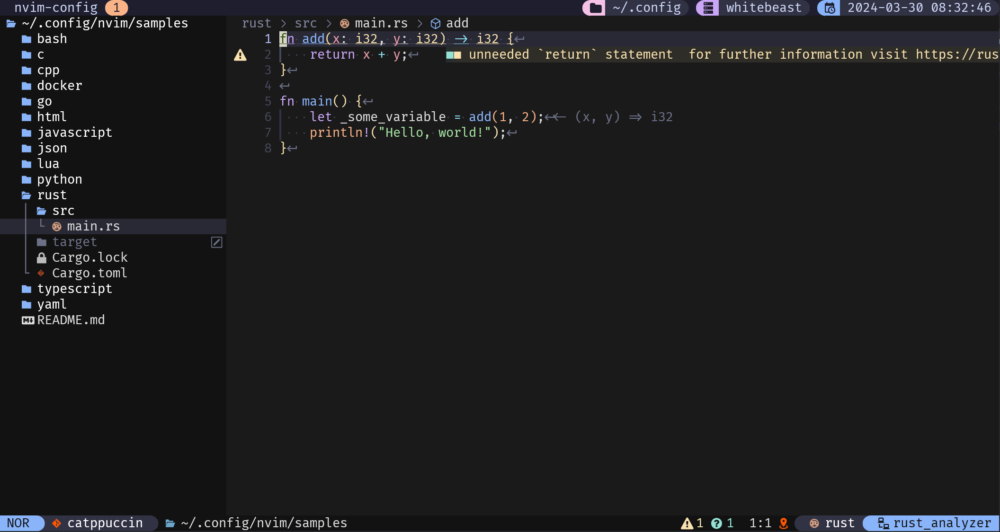
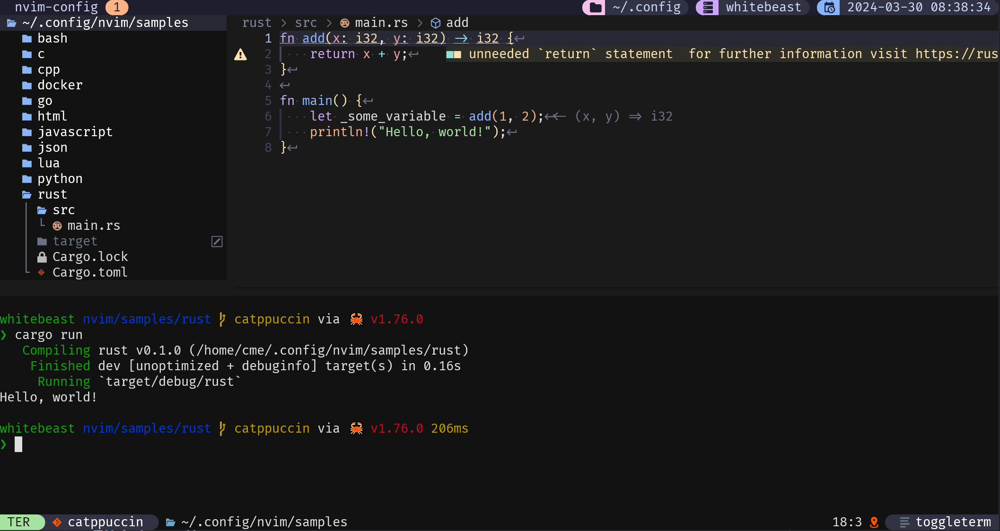
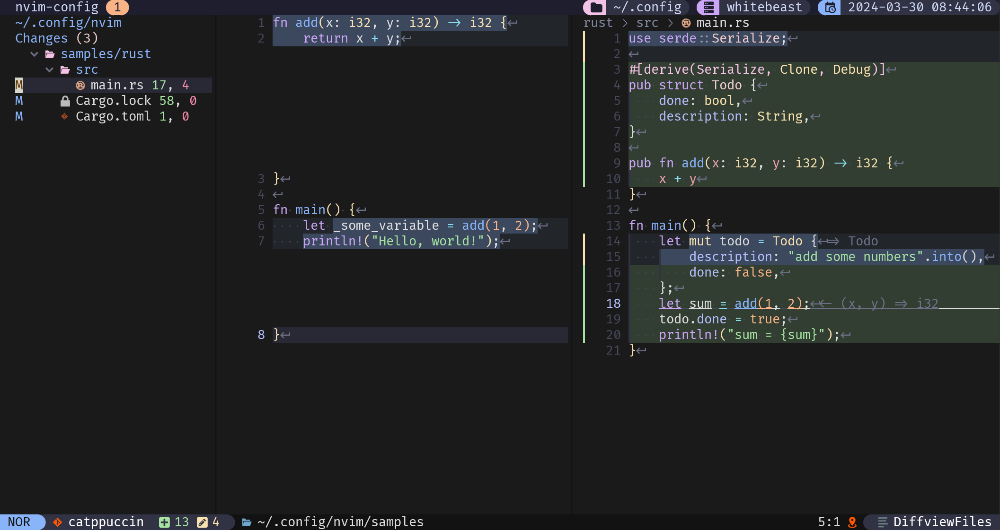
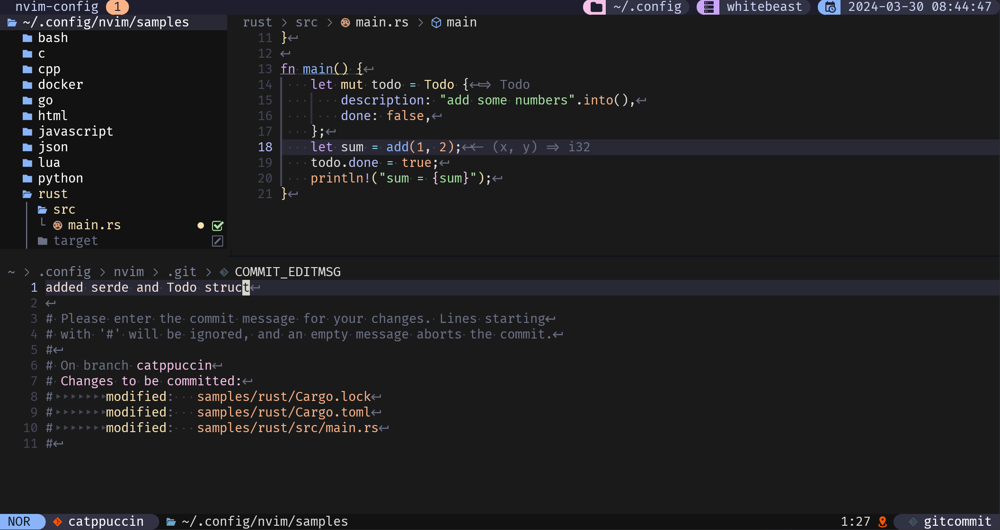

# Neovim Configuration

This is my-own little attempt at a neovim configuration that turns neovim into
my own little '[PDE](https://www.youtube.com/watch?v=QMVIJhC9Veg&ab_channel=TJDeVries)'.
For a complete list of plugins, see [`lazy-lock.json`](lazy-lock.json). All plugin
configurations can be found in [`lua/plugins`](lua/plugins).

## Fuzzy Finding



## LSP Support



## Integrated Terminal



## Git Integration




## Installation

```bash
# don't forget to backup your config beforehand
git clone https://github.com/meuter/nvim ~/.config/nvim
cd ~/.config/nvim/
```

When Neovim starts, everything will be installed automatically:

- the package manager [`lazy.nvim`](https://github.com/folke/lazy.nvim).
- all plugins.
- all Treesitter grammars for all languages supported out of the box.
- all LSP servers for all languages supported out of the box.
- all [`nvim-dap`](https://github.com/mfussenegger/nvim-dap) debuggers.

## Font

You will need a [patched font](https://www.nerdfonts.com/) including the latest
[codicons](https://github.com/microsoft/vscode-codicons) glyphs. All screenshots were taken using
[Fira Code Regular Nerd Font Complete](font/Fira%20Code%20Regular%20Nerd%20Font%20Complete.ttf),
patched manually by yours truly and [Windows Terminal](https://apps.microsoft.com/store/detail/windows-terminal/9N0DX20HK701).

## Trying it out

### Using Docker

If you simply want to test this config without messing up your own, you can do
so in the provided Docker container:

```bash
git clone https://github.com/meuter/nvim /tmp/nvim
cd /tmp/nvim/docker/
make test
```

This will compile the docker container and run a shell. You can then type `nvim`. All the necessary
plugins, packages, etc. will be installed on first start.

### Using NVIM_APPNAME

You can also install this config side-by-side any other config and run it using the `NVIM_APPNAME` 
environement variable:

```bash
git clone https://github.com/meuter/nvim ~/.config/meuter-nvim
NVIM_APPNAME=meuter-nvim nvim
```

## Shameless Plug

If you like the status bar, please take a look at [`lualine-so-fancy.nvim`](https://github.com/meuter/lualine-so-fancy.nvim).
The current version uses a color scheme called [`catppuccin`](https://github.com/catppuccin/nvim), but you might also
enjoy [`habamax-plus.nvim`](https://github.com/meuter/habamax-plus.nvim) which
is a custom fork of the awesome [`habamax`](https://github.com/habamax/vim-habamax), built into neovim.
This config is part of my dotfiles that can be found [here](https://github.com/meuter/dotfiles).

## Prerequisite

See [`Dockerfile`](Dockerfile) for the list of required packages (based on Ubuntu 22.04).
Adapt to your distro accordingly.
